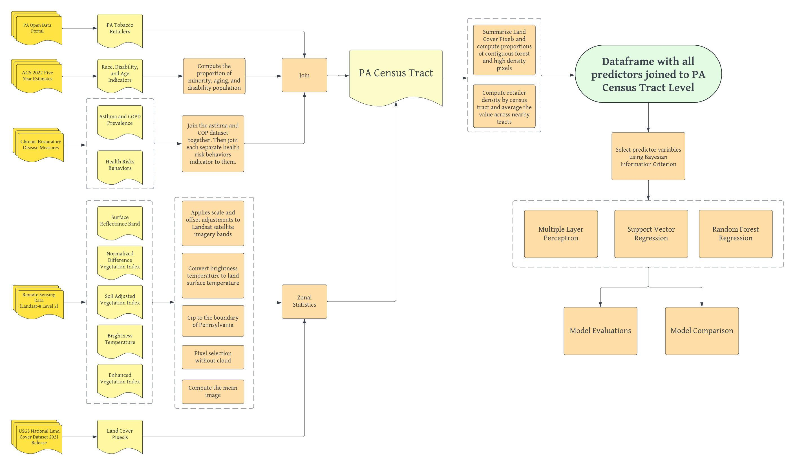

# Spatial Estimation of Seasonal Variability in Chronic Obtrusive Pulmonary Disease Prevalence Based on Geospatial Machine Learning Procedures

This study is inspired by an original paper from:

> Abdur Rehman, N., & Counts, S. (2021). Neighborhood level chronic respiratory disease prevalence estimation using search query data. PloS one, 16(6), e0252383. DOI: [10.1371/journal.pone.0252383](https://doi.org/10.1371/journal.pone.0252383)

## Abstract

Estimating disease prevalence at a sub-city neighborhood scale enables early, targeted interventions that can save lives and reduce public health burdens. 
However, accurately identifying neighborhood-level disease prevalence is challenging due to the cost-prohibitive nature of localized data collection, difficulties in accessing confidential medical records, and the complexity of interactions between multiple potential determinants.

To address these challenges and capture a multidimensional perspective on the determinants of chronic respiratory diseases, this study investigates the environmental, socio-demographic, and behavioral predictors of chronic obstructive pulmonary disease (COPD) at the census tract level in Pennsylvania using machine learning models.
By localizing the analysis to this geographic granularity, we aim to gain a nuanced understanding of spatial disparities in respiratory health.
Drawing on data from tobacco retailer density, census records, health risk behavior surveys, seasonally classified land cover datasets, and satellite-derived vegetation indices, the study identifies the most significant predictors of COPD prevalence. It also evaluates the performance of various analytical techniques, including multilayer perceptron, support vector regression, and random forest regression.

**Contributor:**

Emily Zhou

*Department of City and Regional Planning, Stuart Weitzman School of Design, University of Pennsylvania*

**Key Words:**

chronic respiratory disease, support vector machine, random forest, multiple layer perceptron, deep learning, bayesian information criteria, google earth engine, land cover, geospatial health